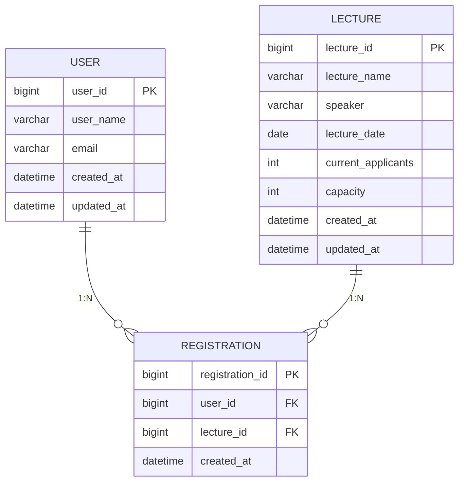
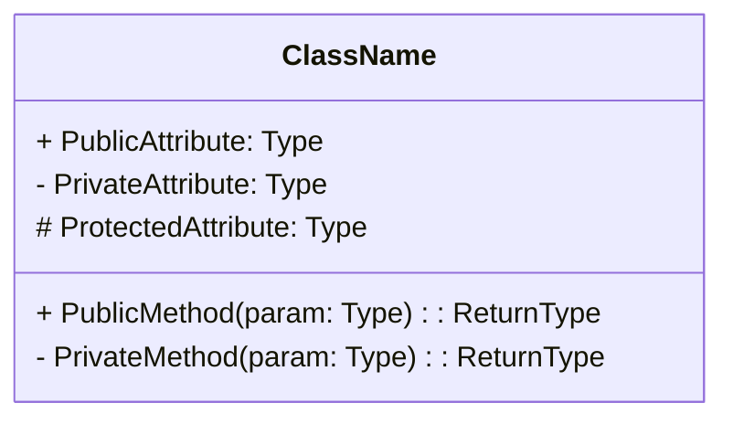

# 항해99 백엔드 플러스 2주차 과제

## 목표

아키텍처와 테스트 코드 작성에 집중하며, 견고하고 유연한 서버 개발을 지향합니다.

## 요구사항 분석

### 특강

- 수강생은 동일한 특강을 한 번의 수강 신청만 성공 가능
- 특강은 선착순 30명까지만 신청 가능

## 테스트 정의서

### 특강

- 수강생이 같은 특강에 여러 번 요청했을 때 한 번만 수강 신청 성공이 되는지
- 수강 신청 등록 완료가 30명이 넘은 특강에 대해 수강 신청이 실패하는지

## 도메인 정의서

### 유저(수강생)

