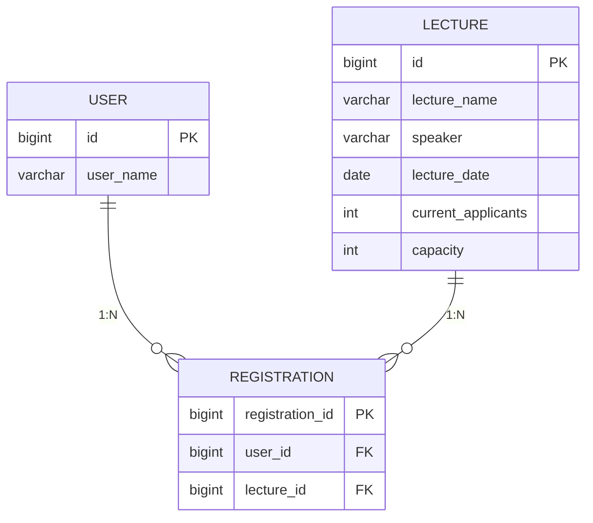
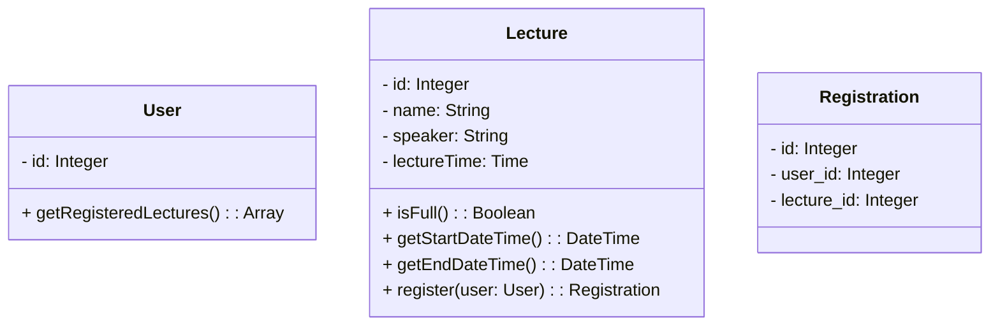

# 항해99 백엔드 플러스 2주차 과제

## 목표

아키텍처와 테스트 코드 작성에 집중하며, 견고하고 유연한 서버 개발을 지향합니다.

## 요구사항 분석

### 특강

- 수강생은 동일한 특강을 한 번의 수강 신청만 성공 가능
- 특강은 선착순 30명까지만 신청 가능

## 테스트 정의서

### 특강

- 수강생이 같은 특강에 여러 번 요청했을 때 한 번만 수강 신청 성공이 되는지
- 수강 신청 등록 완료가 30명이 넘은 특강에 대해 수강 신청이 실패하는지

## 도메인 정의서

### 유저(수강생)

## 궁금점

1. 과제를 통해 달성하고자 하는 목표 (ex. 이번 과제의 경우 클린 아키텍처)에 집중하기 위해 요구사항을 최대한 단순하게 생각했습니다. 예를 들어, 실생활의 경우 하나의 특강이 여러 개의 강의 스케쥴을 가지는 것이 옳겠지만, 과제 핵심에 집중하기 위해 하나의 특강이 하나의 강의 시간만 가지도록 하였는데 앞으로 과제도 이런 식으로 해도 문제 없을까요?
2. 