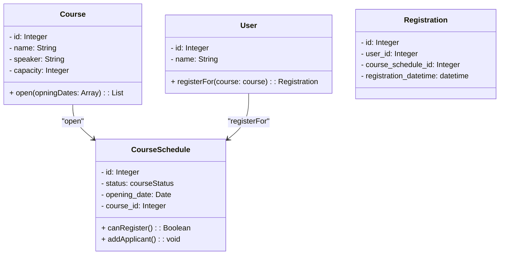
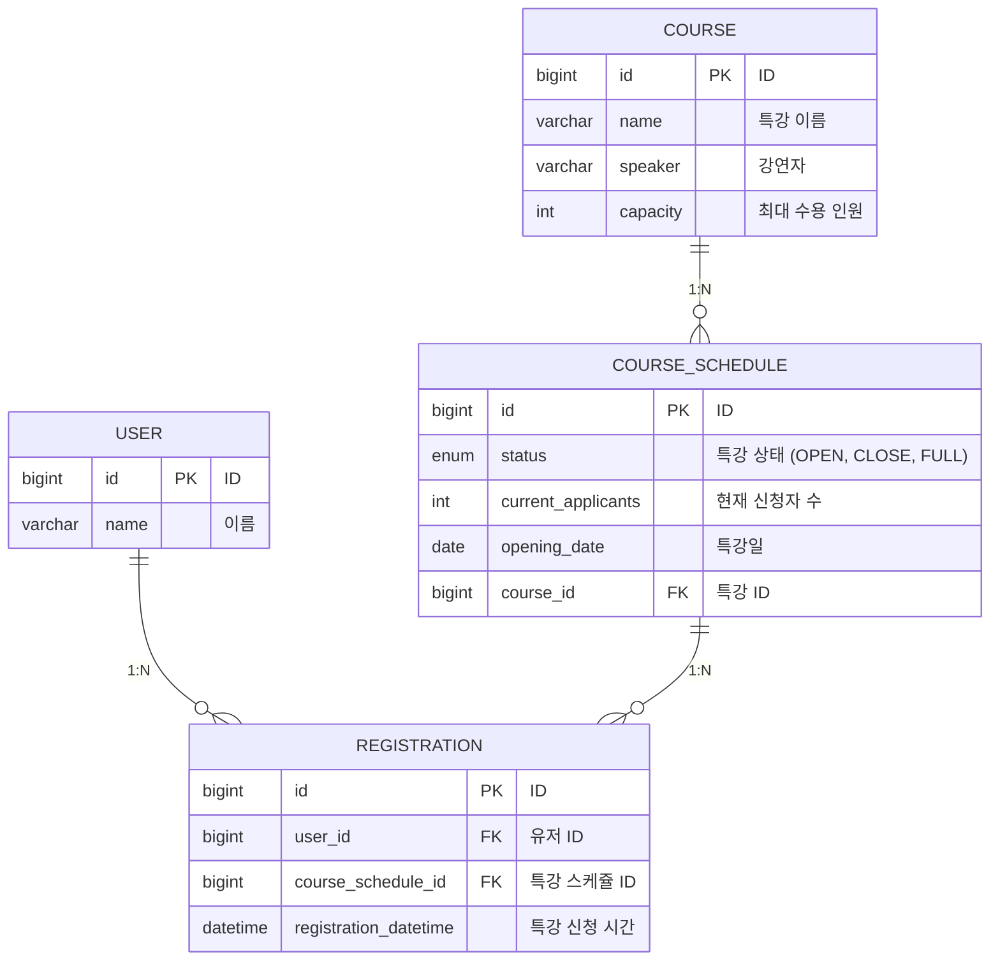

## 요구사항 분석

과제의 목표인 "클린 아키텍처" 주제에 집중하고자 요구사항을 최대한 단순하게 설계하였습니다.

### 공통

- 생성일, 수정일 필드는 제외한다.

### 수강생

- 수강생은 하루에 하나의 특강만 참석할 수 있다.

### 특강

- 동일 특강은 하루에 한 번만 개설 가능하다.
- 하루에 서로 다른 여러 개의 특강이 진행될 수 있다.
- 모든 특강의 정원은 30명이다.

## 도메인 설계



## ERD



## ERD 설계 이유

### USER

- 요구사항을 간략화하기 위해 불필요한 정보들은 최대한 제거하였습니다.

### COURSE

- 특강은 여러 날짜에 개설될 수 있으므로 `COURSE_SCHEDULE`과 1:N 관계를 가지도록 하였습니다.

### COURSE_SCHEDULE

- 특강이 마감되는 경우는 정원이 다 찼을 때를 제외하고도 관리자에 의하여 마감되는 경우를 생각하여 `status` 필드를 추가하였습니다.
- 강의는 별도의 시작 시간, 마감 시간 없이 하루에 한 번만 개설되는 요구사항을 정의하였기 떄문에 `opening_date` 필드를 추가하였습니다.

### REGISTRATION

- 수강생과 특강의 N:M 관계를 풀어내기 위해 `REGISTRATION` 테이블을 추가하였습니다.
- 수강생이 특강을 신청한 시간은 유의미한 정보를 가질 수 있기 떄문에 `registration_datetime` 필드를 추가하였습니다.

## 패키지 구조

```plaintext

package/
├── user/                                   
│   ├── domain/                             # 도메인 계층
│   │   ├── User.java
│   │   ├── UserService.java                # 도메인 서비스
│   │   ├── UserRepository.java
│   │   ├── dto/                            # 도메인 계층 DTO
│   │   │   ├── request/
│   │   │   │   └── UserCommand.java
│   │   │   └── response/
│   │   │       └── UserInfo.java
│   ├── interfaces/                         # 인터페이스 계층
│   │   ├── UserController.java
│   │   ├── dto/                            # 인터페이스 계층 DTO
│   │   │   ├── request/
│   │   │   │   └── UserRequest.java
│   │   │   └── response/
│   │   │       └── UserResponse.java
│   └── infrastructure/                     # 인프라스트럭처 계층
│       └── persistence/                    # 영속성 기술
│           ├── jpa/
│           │   └── UserJpaRepository.java
│           └── UserRepositoryImpl.java 
├── course/
|   ├── ...위와 동일    
```

## API 명세서

### 특강

#### 특강 만들기

**Request**

```http
POST /courses
Content-Type: application/json

{
    "name": "항해99 백엔드 플러스",
    "speaker": "항해99"
}
```

**Response**

```http
HTTP/1.1 201 Created
Content-Type: application/json
Header: Location: /courses/1
```

#### 특강 열기

**Request**

```http
POST /courses/1/open
Content-Type: application/json

{
    "openingDates": [
        "2021-07-01"
    ]
}
```

**Response**

```http
HTTP/1.1 204 No Content
Content-Type: application/json
```

#### 특강 목록 조회

**Request**

```http
GET /courses?startDate=2024-07-01&endDate=2024-08-01&status=OPEN
Content-Type: application/json
Query Parameters:
- startDate: 시작일
- endDate: 종료일
- status: 특강 상태 (OPEN, CLOSE, FULL)
```

**Response**

```http
HTTP/1.1 200 OK
Content-Type: application/json

[
    {
        "id": 1,
        "name": "항해99 백엔드 플러스",
        "speaker": "항해99",
        "capacity": 30,
        "openingDates": [
            {
                "date": "2021-07-01",
                "status": "OPEN",
                "currentApplicants": 11
            },
            {
                "date": "2021-07-02",
                "status": "FULL",
                "currentApplicants": 30
            },
            {
                "date": "2021-07-03",
                "status": "CLOSE",
                "currentApplicants": 0
            },
            ...
        ],
    },
    {
        ...
    },
]
```

### 유저

#### 신청 완료한 특강 목록 조회

**Request**

```http
GET /users/1/courses
Content-Type: application/json
```

**Response**

```http
HTTP/1.1 200 OK
Content-Type: application/json

[
    {
        "courseId": 1,
        "name": "항해99 백엔드 플러스",
        "speaker": "항해99",
        "status": "OPEN",
        "registeredDateTime": "2021-07-01T09:00:00Z",
        "openingDate": "2021-07-15",
        "capacity": 30,
        "currentApplicants": 11
    }
]
```

### 특강 신청하기

**Request**

```http
POST /users/1/courses
Content-Type: application/json

{
    "courseId": 1,
    "openingDate": "2021-07-15"
}
```

**Response**

```http
HTTP/1.1 200 No Content
Content-Type: application/json
```